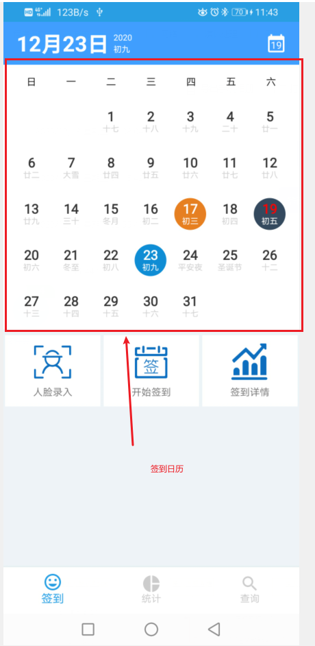
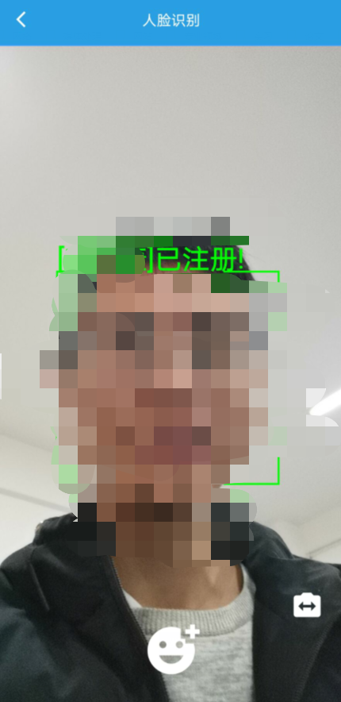
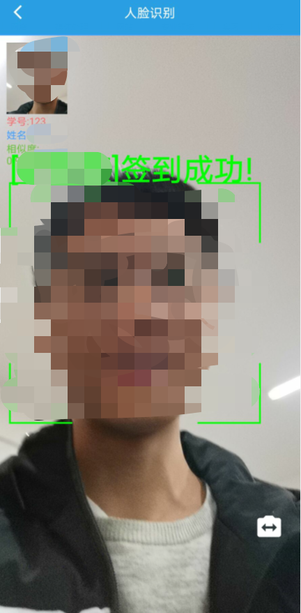
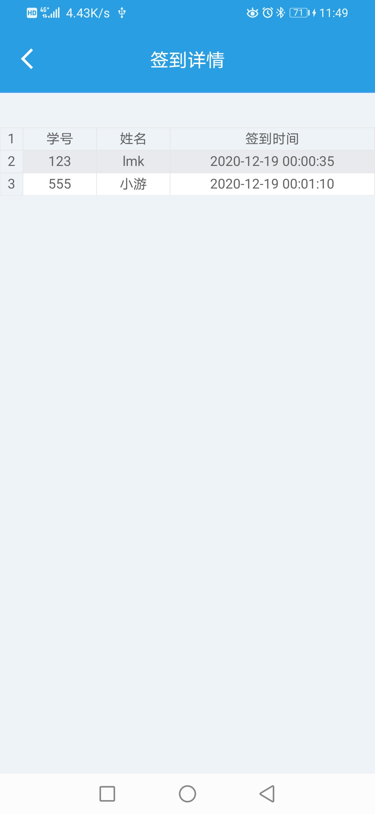
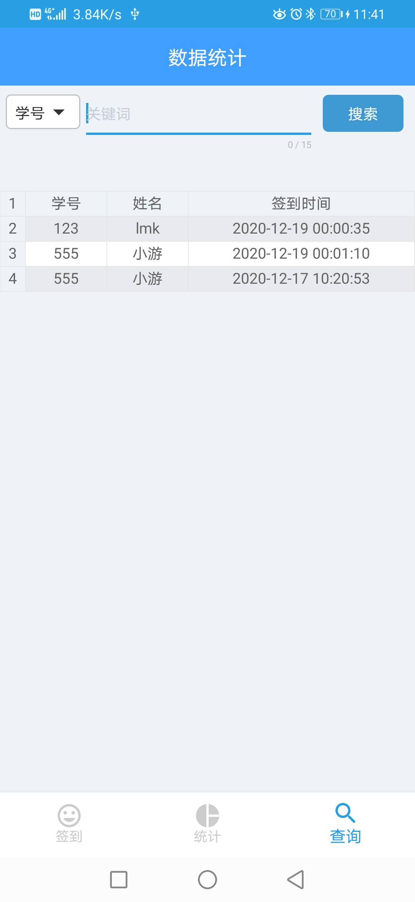
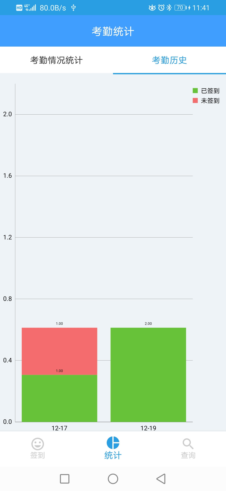

# 人脸识别签到app

该项目fork自[xiaoyou-project/android-course-design: 安卓课程设计代码-人脸识别签到 (github.com)](https://github.com/xiaoyou-project/android-course-design)，并在此基础上进行了一定的修改。

## 这是什么？

本项目(**人脸识别签到app**)是基于虹软(ArcSoft)的人脸识别SDK进行开发的人脸识别签到安卓应用，让你可以在安卓手机上**离线**、**快速**、**准确**的进行校园人脸识别，准确识别注册过的人脸信息，**支持多人**同时签到，快速识别多个人脸，在不同光照条件下进行准确的人脸识别，并自动保存和统计签到记录。


## 功能介绍

### 签到日历功能



### 人脸录入



### 签到功能



### 签到详情



### 签到数据查询



### 图表展示




## 如何使用

由于app的人脸识别功能需要通过虹软认证激活，故不提供apk安装包，请自行获取源码后调整SDK相关设置后自行编译打包运行。


### 限制条件

本项目使用虹软官方提供的SDK来实现离线人脸识别功能，由于官方SDK早在2020年对该项目停止维护，将开发重心转移至其他项目，故本项目**仅支持Android10及以下**正常运行，且**仅支持arm64-v8a和armeabi-v7a**两种abi。

### 获取源码

git命令行获取

```
https://github.com/Luckybird1027/Android_Course_Design--Face_Recognition.git
```

### 配置项目

前往[开发者中心 (arcsoft.com.cn)](https://ai.arcsoft.com.cn/ucenter/resource/build/index.html#/index)注册开发者账户并申请SDK使用，获取**APP_ID**与**SDK_KEY**，并下载SDK。

将app/src/main/java/com/xiaoyou/face/common/Constants.java中的**APP_ID**与**SDK_KEY**修改为从虹软官网处获得的**APP_ID**与**SDK_KEY**，并将从虹软下载的SDK包中的相应部分替换到项目中的相应部分（自行查阅文档，本readme不赘述）。

完成后编译打包安装即可。

### 应用运行

首次打开app时需要激活人脸识别引擎，如遇人脸识别功能无法正常使用，你可以尝试点击主页右下角的logo按钮进行激活引擎，按照提示进行。
